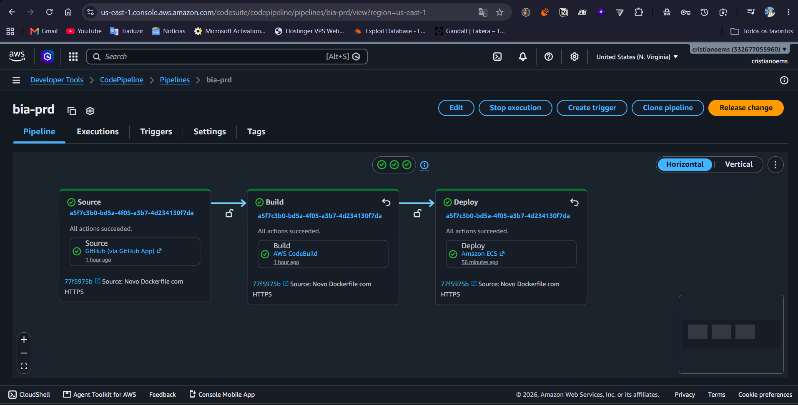

# 📚 Documentação

## 🏗️ Arquitetura AWS
- [Diagrama ECS + EC2](./architecture/aws-ecs-diagram.html) - Visualização de uma das arquiteturas propostas para iniciar no treinamento e evoluir na Formação AWS

## 📌 Índice de Conteúdos

* 📜 **[Certificado de Conclusão](./certification/README.md)** — Visualize o certificado da imersão.
* 🛠️ **[Guia para Recriar Infraestrutura](./infraestrutura-recriar.md)** — Passo a passo completo para subir a infra na AWS.
* 🌐 **[Solução Route 53 / HTTPS](./rota53/README.md)** — Workaround para habilitar HTTPS no ALB sem custos no Free Tier.
* * 📧 **[Comprovante de Inscrição / E-mail](./email/README.md)** — Confirmação do desafio protegida por criptografia e salt (CTF).

## 🚀 Conclusão de Desafios & Provas de Conceito (PoC)

### 🔹 Aplicação no Ar & Balanceamento de Carga
Serviço rodando com sucesso e tráfego mapeado para a porta 80.

### 🔹 Target Group Configurado
Target Group do Application Load Balancer saudável e recebendo requisições.

### 🔹 Automação com Kiro CLI
CLI do Kiro integrada e 100% operacional no ambiente.

### 🔹 Pipeline CI/CD Concluído
Status verde indicando o sucesso da esteira de deploy automático.

### 🔹 Desafio Finalizado

