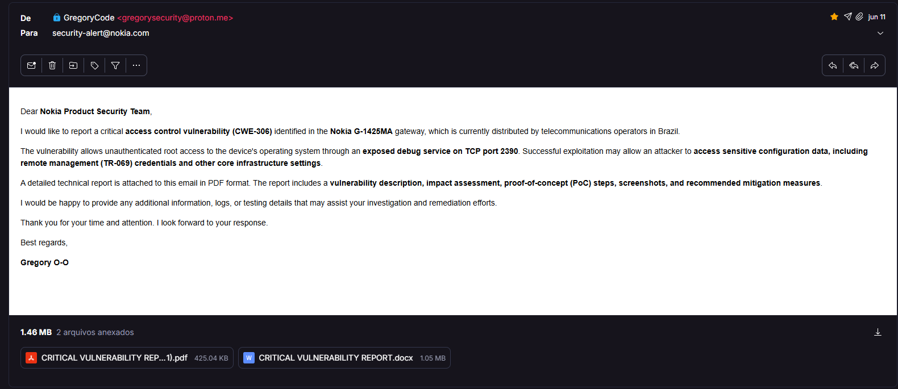
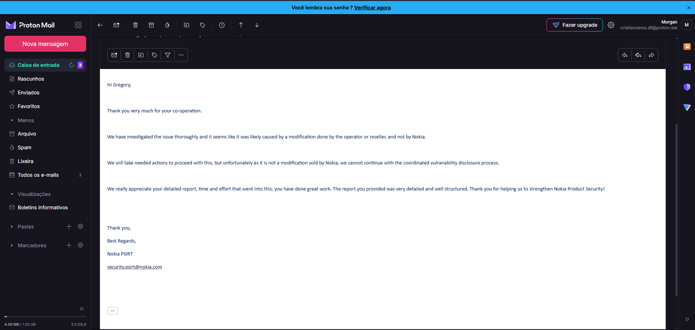
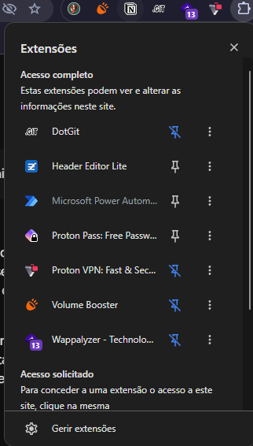

# 🚀 Desafio 1: Imersão AWS & IA

Repositório oficial para submissão e documentação de infraestrutura da Imersão AWS & IA.

---

## 🔒 Security & Compliance Notice

A documentação e os comprovantes de conclusão passaram por um rigoroso processo de anonimização e criptografia de ponta.

O comprovante oficial encontra-se anexado no arquivo:
📂 [comprovante_blindado.pdf](./comprovante_blindado.pdf)

---

## 🔑 Access Control & Enigma

O arquivo PDF está protegido por uma senha mestra. A chave de descriptografia não está exposta em texto plano, pois foi processada utilizando uma função de derivação de chave baseada em salt (**PBKDF2-HMAC-SHA256** com 100.000 iterações). 

### Parâmetros do Enigma:
* **Salt Utilizado:** `desafio`
* **Ciphertext / Hash Alvo:** 
  `b7ef1088af2683e1dff6116ea832983ced276b5b78f1e6fdc0e5eedf711576f9`

> **Dica de Ferramenta:** Se quiser testar via linha de comando pura, você pode utilizar o utilitário oficial do [OpenSSL](https://www.openssl.org/) para processar a derivação de chave.
---

## 📋 Wordlist Embutida

Para auxiliar na resolução (ou testar suas habilidades de força bruta/dicionário), utilize o conjunto de strings abaixo como base de testes no seu script de descriptografia:

```text
ADMIN, SECRET, PASSWORD, 123456, ROOT, LAMBDA, DOCKER, KUBERNETES, CLOUD, SECURITY, CIA, SUBMARINECABLE, STUXNET, AWS, TERRAFORM, LINUX, KALI, PYTHON, HACKER, CIPHER, CRYPTO, NETWORK, FIREWALL, PAYLOAD, EXPLOIT
```

# 💬 FAQ & Sobre Mim

Bem-vindo à seção de perguntas frequentes sobre mim e sobre os bastidores dos meus projetos! Aqui você descobre um pouco mais sobre quem eu sou, o que me move na tecnologia e como me encontrar.

---

### Q: Quem é você e o que você faz?
* **Idade:** 16 anos.
* **Pentest / Hacker:** Me divirto rodando scans de rede, analisando infraestruturas, descobrindo comportamentos de sistemas de baixo nível e buscando entender como as coisas funcionam por dentro.
* **Programador Aprendiz & Aluno de Ensino Médio:** Programo há mais de quatro anos por puro entusiasmo e aprendizado contínuo. 
* **Aprendiz de Cloud & Baixo Nível:** Mergulhando fundo em arquitetura de nuvem, sistemas operacionais e estudando Assembly para resolver desafios avançados.
* **Objetivo Atual:** Aperfeiçoar lógica, resolver desafios de código e, quem sabe, conseguir minha própria CVE no processo.

---

### Q: Qual é a sua filosofia sobre programação e tecnologia?
Eu não estudo e programo apenas por dinheiro — embora ele seja importante. Para mim, o conhecimento e a curiosidade genuína sempre se sobressaem. Passei boa parte da minha vida aprendendo coisas novas e tenho plena consciência de que ninguém sabe tudo. Sou apenas um aprendiz disposto a errar, evoluir e construir coisas novas. Estou aberto a qualquer ideia, projeto ou desafio. Inclusive, no momento estou focado em Assembly para encarar uns LeetCodes em baixo nível.

---

### Q: Quais são os seus interesses e curiosidades fora o código?
* **Comida favorita:** Pizza, sem dúvidas.
* **Áreas de interesse:** Sou fascinado por marketing, inteligência e análise de sistemas.
* **Perfil pessoal:** Sou introvertido, tenho ambição de criar minha própria empresa no futuro e não uso redes sociais em excesso.
* **Leituras e Hobbys:** Leio muitos TCCs de programação (especialmente da UnB — já foram uns cinco na conta) e adoro investigar o funcionamento de hardwares e redes do cotidiano.
* **Histórias de laboratório:** Certa vez investiguei o que achei ser uma vulnerabilidade crítica em um modem da Nokia, mas descobri que era uma porta aberta deixada pela própria operadora que dava acesso root direto. Por questões de ética, privacidade e segurança, optei por manter a operadora em sigilo, mas fica a lição: todo mundo erra e aprende na prática.

## 🔍 Relato Técnico & Resposta do PSIRT

Se não tá acreditando? Tá aí a prova do envio do relatório e o retorno oficial da equipe de segurança:

### 1. Envio do Alerta (Relatório Inicial)


### 2. Resposta Oficial da Nokia


---

## 🧩 Setup & Ferramentas do Navegador

Para quem tem curiosidade sobre o ecossistema diário de testes, privacidade e desenvolvimento, estas são as extensões ativas no browser:



---

### Q: Como posso entrar em contato ou acompanhar seu trabalho?
Se quiser trocar ideia sobre projetos, tecnologia, segurança ou propostas, pode me chamar por aqui:

* 📧 **ProtonMail:** `cristianoems.df@proton.me`
* 🎮 **Discord:** `morganoficial` (minha conta principal de trabalho).
* 🌐 **Reddit:** [u/CristianoMarques23](https://www.reddit.com/user/CristianoMarques23/)
