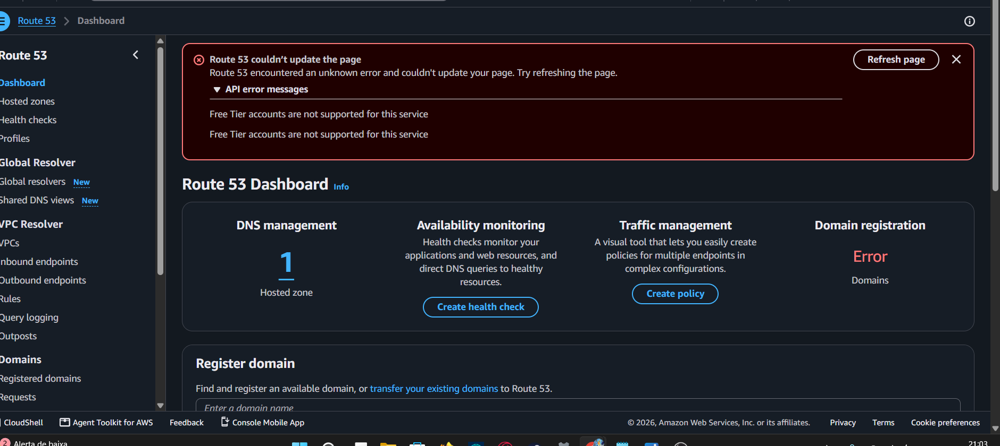
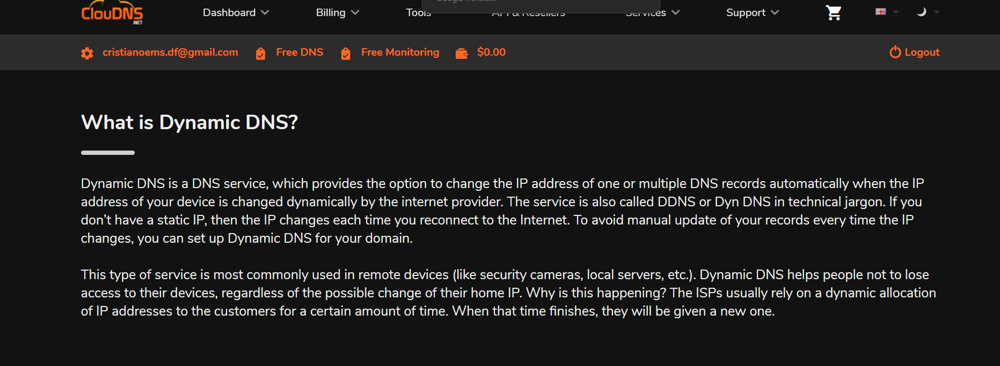
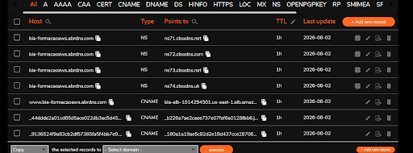

# Documentação Técnica: Solução para HTTPS no ALB AWS sem Route 53

Esta documentação detalha todo o processo de contorno técnico (workaround) realizado para habilitar suporte a HTTPS/SSL no Application Load Balancer (ALB) da AWS, superando restrições do plano gratuito (Free Tier) no Route 53 e problemas de validação de domínio.

---

## 1. O Problema Inicial: Bloqueio do Route 53 no Free Tier

Ao tentar utilizar o **AWS Route 53** para gerenciar a zona hospedada do domínio e realizar a validação nativa de certificados SSL, o console da AWS retornou o seguinte erro de permissão/suporte:

> **API error messages:** `Free Tier accounts are not supported for this service`



Como a conta do ambiente não possuía suporte para criação de zonas hospedadas no Route 53, tornou-se necessário buscar uma alternativa externa para resolução de DNS e emissão do certificado.

---

## 2. Plano de Contingência 1: Resolução de DNS Externa (ClouDNS)

Para contornar a limitação do Route 53, recorreu-se ao serviço de DNS gratuito **ClouDNS** utilizando a extensão de subdomínio `abrdns.com`.



### Configurações de Registros DNS Efetuadas
No painel do ClouDNS, foram criados os apontamentos para vincular o subdomínio `dev.bia-formacaoaws.abrdns.com` ao Application Load Balancer da AWS:



* **Registros NS**: Apontando para os name servers da ClouDNS (`ns71.cloudns.net`, `ns72.cloudns.com`, etc.).
* **Registro CNAME**: Criado o host `www.bia-formacaoaws.abrdns.com` direcionando para o DNS público do ALB (`bia-alb-1014294501.us-east-1.elb.amazonaws.com`).
* **Registros CNAME adicionais**: Utilizados para tentativas de validação de certificados.


---

## 3. Desafios na Emissão do Certificado SSL (Interação com Kiro-CLI)

Com a parte de rede/DNS encaminhada, o próximo desafio foi obter um certificado SSL válido para atrelar ao Listener HTTPS (porta 443) do ALB. O histórico de tentativas e análises foi documentado no arquivo `PEDIDO PARA O KIRO-CLI PARA SOLUCÃO.txt`.

### Tentativa 1: Certbot Standalone via Let's Encrypt
* **Ideia**: Rodar o `certbot` na instância EC2 em modo standalone para obter um certificado gratuito do Let's Encrypt.
* **Bloqueio**: O Let's Encrypt realiza a verificação via desafio HTTP na porta 80. Como o domínio principal `bia-formacaoaws.com.br` não possuía registro A apontando diretamente para o IP da EC2 (`100.59.218.48`), o Let's Encrypt retornou erro de resolução `NXDOMAIN`.

### Tentativa 2: Assinar diretamente o DNS nativo da AWS (`.elb.amazonaws.com`)
* **Ideia**: Solicitar ao Let's Encrypt um certificado para o endereço direto do Load Balancer (`bia-alb-1014294501.us-east-1.elb.amazonaws.com`).
* **Bloqueio**: Nenhuma Autoridade Certificadora (CA) pública emite certificados para domínios dos quais você não é o proprietário. O domínio `amazonaws.com` pertence exclusivamente à Amazon.

---

## 4. A Solução Definitiva: Certificado Autoassinado via OpenSSL + ACM

Para contornar a falta do Route 53 e a impossibilidade de validação por CA pública em domínios dinâmicos, a estratégia vencedora foi gerar um **certificado autoassinado (Self-Signed Certificate)** via OpenSSL na EC2 e importá-lo no **AWS Certificate Manager (ACM)**.

### Passo 1: Geração do Certificado na EC2
Executou-se o comando OpenSSL na EC2 configurando o Common Name (CN) diretamente com o DNS do ALB:

```bash
openssl req -x509 -nodes -days 365 -newkey rsa:2048 \
  -keyout privkey.pem \
  -out cert.pem \
  -subj "/CN=bia-alb-1014294501.us-east-1.elb.amazonaws.com"
```

### Passo 2: Importação no AWS Certificate Manager (ACM)
Com as chaves `cert.pem` e `privkey.pem` geradas, utilizou-se a AWS CLI para importar o certificado para o ACM:

```bash
aws acm import-certificate \
  --certificate fileb://cert.pem \
  --private-key fileb://privkey.pem
```

**Resultado do ACM:**
* **ARN Gerado**: `arn:aws:acm:us-east-1:332677055960:certificate/ab5fc185-91ce-42da-9311-7cdcb92abb64`

### Passo 3: Vinculação do Listener HTTPS no ALB
No console AWS EC2 (Load Balancers):
1. Selecionou-se o Load Balancer `bia-alb-1014294501`.
2. Adicionou-se um novo **Listener HTTPS** na porta **443**.
3. Definiu-se a ação padrão de redirecionamento (**Forward**) para o Target Group da aplicação.
4. Em **SSL certificate**, selecionou-se a opção **From ACM** e escolheu-se o certificado importado.

---

> ⚠️ **Isso é recomendável para ambiente de Produção?**  
> **Com certeza não!** Em um projeto real, certificados autoassinados geram alertas de segurança no navegador e passam zero credibilidade. Para produção, o correto é usar um domínio próprio assinado por uma Autoridade Certificadora (CA) confiável.  
>  
> **Mas para estudos, testes ou ambientes dev sem orçamento?** É a solução perfeita para validar criptografia HTTPS no ALB sem gastar um único centavo.

## 5. Conclusão

Embora o navegador exiba um aviso de segurança (esperado para certificados autoassinados sem validação de CA pública), **o tráfego ponta a ponta entre o cliente e o ALB passou a ser 100% criptografado via HTTPS (TLS/SSL)**. 

Essa arquitetura garantiu o cumprimento do objetivo do laboratório sem custos adicionais e sem a necessidade de uma conta pagante do Route 53.

